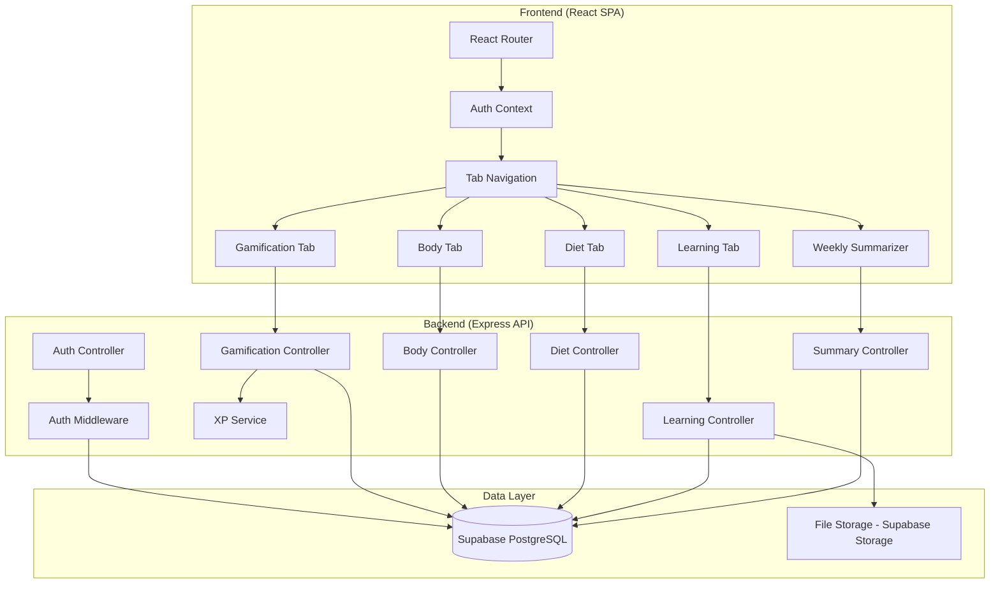
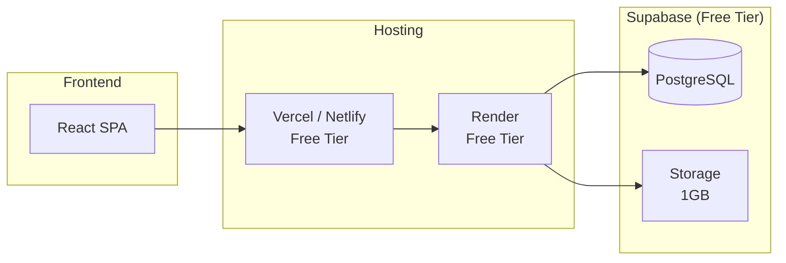

# Design Document: Level Up Portal

## Overview

The Level Up Portal is a single-user personal growth web application that centralizes self-improvement tracking across four life domains: Gamification, Body & Fitness, Diet & Nutrition, and Learning. The application uses a dark-themed aesthetic with vibrant accent colors and provides gamification mechanics (XP, levels, quests, skills) to motivate progress. A weekly summarizer generates Markdown reports for AI-assisted review sessions.

This is a greenfield project. The application will be built as a single-page application (SPA) with a REST API backend and a relational database for persistence.

### Key Design Decisions

- **Frontend**: React with TypeScript — component-based architecture fits the tabbed UI, strong typing reduces bugs in complex state like XP calculations.
- **Backend**: Node.js with Express and TypeScript — shared language with frontend, good ecosystem for REST APIs.
- **Database**: Supabase-hosted PostgreSQL — relational model suits the structured data (users, quests, measurements, recipes), supports complex queries needed for weekly summaries. Hosted on Supabase free tier so friends can access the app without local database setup. Prisma connects via the Supabase connection string.
- **ORM**: Prisma — type-safe database access, schema-driven migrations, good TypeScript integration.
- **File Storage**: Supabase Storage — document uploads (Learning Tab) are stored in Supabase Storage instead of local disk. The Document model's `filePath` field stores the Supabase Storage object path/URL. Free tier provides 1GB storage.
- **Charting**: Recharts — React-native charting library for weight graphs and calorie breakdowns.
- **Authentication**: JWT-based session tokens with bcrypt password hashing.
- **Styling**: Tailwind CSS with a custom dark theme configuration using CSS custom properties for accent colors.

## Architecture

The application follows a client-server architecture with clear separation between the frontend SPA and the backend API.



### Request Flow

1. User interacts with the React frontend
2. Frontend sends HTTP requests with JWT in Authorization header
3. Auth middleware validates the token on every protected route
4. Controller processes the request, delegates to services for business logic (e.g., XP calculations)
5. Prisma ORM handles database operations
6. Response returns JSON to the frontend

### Deployment Architecture

The application is deployed across free-tier cloud services so friends can access it without local setup:



- **Frontend (React SPA)**: Deployed to Vercel or Netlify (free tier). Static build output served via CDN.
- **Backend (Express API)**: Deployed to Render (free tier). Runs the Express server with Prisma client.
- **Database**: Supabase PostgreSQL (free tier). Prisma connects via the Supabase connection string (`DATABASE_URL`).
- **File Storage**: Supabase Storage (free tier, 1GB). Document uploads go here instead of local disk.

#### Required Environment Variables

| Variable | Service | Purpose |
|----------|---------|---------|
| `DATABASE_URL` | Render (backend) | Supabase PostgreSQL connection string |
| `SUPABASE_URL` | Render (backend) | Supabase project URL for Storage API |
| `SUPABASE_SERVICE_KEY` | Render (backend) | Supabase service role key for Storage operations |
| `JWT_SECRET` | Render (backend) | Secret for signing JWT auth tokens |

## Components and Interfaces

### Frontend Components

#### Auth Components
- `LoginPage` — Login form with email/password fields, error display
- `AuthContext` — React context providing auth state, login/logout functions, JWT management

#### Navigation
- `TabNavigation` — Horizontal tab bar with Gamification, Body, Diet, Learning tabs. Active tab highlighted with accent color.
- `Dashboard` — Main layout wrapper containing TabNavigation and active tab content

#### Gamification Tab
- `GamificationTab` — Container for all gamification content
- `LevelDisplay` — Shows current level, XP progress bar with accent color fill
- `QuestList` — Lists active quests with progress indicators
- `QuestForm` — Create/edit quest with title, description, steps
- `TaskList` — Shows daily and weekly tasks with completion toggles
- `TaskForm` — Create task with recurrence type (daily/weekly)
- `SkillList` — Shows all skills with individual level bars
- `SkillForm` — Create skill, log skill activity

#### Body Tab
- `BodyTab` — Container for body tracking content
- `WeightChart` — Line graph of weight over time using Recharts, with time range selector
- `WeightForm` — Log weight entry
- `MeasurementList` — Shows latest measurements per type with change indicators
- `MeasurementForm` — Log measurement (type dropdown, value)
- `GymSessionLog` — List of recent gym sessions
- `GymSessionForm` — Log session with exercises, sets, reps, weight, muscle groups
- `MuscleHeatMap` — SVG body diagram with color-coded soreness intensity
- `TrainingProgramView` — Weekly program display with day-by-day exercises
- `TrainingProgramForm` — Create/edit training program

#### Diet Tab
- `DietTab` — Container for diet content
- `CalorieTracker` — Daily calorie summary with goal progress, breakdown by meal type
- `FoodEntryForm` — Log food with name, calories, meal type
- `RecipeList` — Browsable/searchable recipe collection
- `RecipeDetail` — Full recipe view with ingredients, steps, nutrition
- `RecipeForm` — Create/edit recipe
- `MealPrepPlan` — Weekly meal plan grid (days × meal types)
- `MealPrepForm` — Assign recipes to days/meals
- `GroceryList` — Combined ingredient list for a selected day

#### Learning Tab
- `LearningTab` — Container for learning content
- `DocumentList` — Documents organized by category, with search
- `DocumentUpload` — Upload form for PDF/Markdown files with title and category
- `DocumentViewer` — Inline viewer for Markdown, download link for PDFs

#### Weekly Summarizer
- `WeeklySummary` — Generates and displays Markdown summary, copy-to-clipboard button

### Backend API Endpoints

#### Authentication
| Method | Endpoint | Description |
|--------|----------|-------------|
| POST | `/api/auth/login` | Authenticate user, return JWT |
| POST | `/api/auth/logout` | Invalidate session |
| GET | `/api/auth/me` | Get current user info |

#### Gamification
| Method | Endpoint | Description |
|--------|----------|-------------|
| GET | `/api/gamification/status` | Get level, XP, progress |
| GET | `/api/quests` | List all quests |
| POST | `/api/quests` | Create quest |
| PATCH | `/api/quests/:id/steps/:stepId` | Mark step complete |
| GET | `/api/tasks` | List daily/weekly tasks |
| POST | `/api/tasks` | Create task |
| PATCH | `/api/tasks/:id/complete` | Mark task complete |
| GET | `/api/skills` | List all skills |
| POST | `/api/skills` | Create skill |
| POST | `/api/skills/:id/log` | Log skill activity |

#### Body
| Method | Endpoint | Description |
|--------|----------|-------------|
| GET | `/api/weight` | Get weight entries (with date range query) |
| POST | `/api/weight` | Log weight entry |
| GET | `/api/measurements` | Get measurements (filterable by type) |
| POST | `/api/measurements` | Log measurement |
| GET | `/api/gym-sessions` | List gym sessions |
| POST | `/api/gym-sessions` | Log gym session |
| GET | `/api/gym-sessions/heatmap` | Get muscle soreness data |
| GET | `/api/training-programs` | List training programs |
| POST | `/api/training-programs` | Create training program |
| PATCH | `/api/training-programs/:id/activate` | Set active program |

#### Diet
| Method | Endpoint | Description |
|--------|----------|-------------|
| GET | `/api/food-entries?date=` | Get food entries for a date |
| POST | `/api/food-entries` | Log food entry |
| GET | `/api/calorie-goal` | Get daily calorie goal |
| PUT | `/api/calorie-goal` | Set daily calorie goal |
| GET | `/api/recipes` | List/search recipes |
| POST | `/api/recipes` | Create recipe |
| GET | `/api/recipes/:id` | Get recipe detail |
| GET | `/api/meal-prep` | Get current week meal prep plan |
| POST | `/api/meal-prep` | Create/update meal prep plan |
| GET | `/api/meal-prep/:day/grocery-list` | Get grocery list for a day |

#### Learning
| Method | Endpoint | Description |
|--------|----------|-------------|
| GET | `/api/documents` | List/search documents |
| POST | `/api/documents` | Upload document (file stored in Supabase Storage) |
| GET | `/api/documents/:id` | Get/download document |
| GET | `/api/documents/categories` | List categories |

#### Weekly Summary
| Method | Endpoint | Description |
|--------|----------|-------------|
| GET | `/api/weekly-summary?weekOf=` | Generate weekly summary |

### XP Service (Business Logic)

The XP Service encapsulates all experience point calculations and level progression logic:

```typescript
interface XPService {
  awardXP(userId: string, amount: number, source: string): Promise<XPResult>;
  getCurrentLevel(totalXP: number): number;
  getXPForNextLevel(currentLevel: number): number;
  getProgressToNextLevel(totalXP: number): { current: number; required: number; percentage: number };
}
```

**Level formula**: Each level requires `100 * level` XP. Level 1 requires 100 XP, level 2 requires 200 XP, etc. Total XP for level N = `50 * N * (N + 1)`.

### Soreness Calculator

Calculates muscle soreness intensity for the heat map based on recent gym sessions:

```typescript
interface SorenessCalculator {
  calculateSoreness(sessions: GymSession[], asOfDate: Date): Map<MuscleGroup, number>;
}
```

**Soreness formula**: For each muscle group, sum the volume (sets × reps × weight) of exercises targeting it from the last 7 days, weighted by recency (more recent = higher intensity). Normalize to a 0-100 scale.

## Data Models

### Entity Relationship Diagram

```mermaid
erDiagram
    User ||--o{ Quest : creates
    User ||--o{ Task : creates
    User ||--o{ Skill : tracks
    User ||--o{ WeightEntry : logs
    User ||--o{ Measurement : logs
    User ||--o{ GymSession : logs
    User ||--o{ TrainingProgram : creates
    User ||--o{ FoodEntry : logs
    User ||--o{ Recipe : creates
    User ||--o{ MealPrepPlan : creates
    User ||--o{ Document : uploads

    Quest ||--o{ QuestStep : contains
    GymSession ||--o{ Exercise : includes
    Exercise ||--o{ ExerciseMuscleGroup : targets
    Recipe ||--o{ Ingredient : contains
    MealPrepPlan ||--o{ MealPrepEntry : contains
    MealPrepEntry ||--o| Recipe : references
    TrainingProgram ||--o{ ProgramDay : contains
    ProgramDay ||--o{ ProgramExercise : includes

    User {
        uuid id PK
        string email
        string passwordHash
        int totalXP
        datetime createdAt
    }

    Quest {
        uuid id PK
        uuid userId FK
        string title
        string description
        int xpReward
        boolean completed
        datetime createdAt
    }

    QuestStep {
        uuid id PK
        uuid questId FK
        string description
        int sortOrder
        boolean completed
    }

    Task {
        uuid id PK
        uuid userId FK
        string title
        enum recurrence "daily | weekly"
        int xpReward
        boolean completedToday
        datetime lastCompletedAt
        datetime createdAt
    }

    Skill {
        uuid id PK
        uuid userId FK
        string name
        int totalXP
        datetime createdAt
    }

    WeightEntry {
        uuid id PK
        uuid userId FK
        float weight
        date date
    }

    Measurement {
        uuid id PK
        uuid userId FK
        enum type "chest | waist | hips | arms | thighs"
        float value
        date date
    }

    GymSession {
        uuid id PK
        uuid userId FK
        date date
        string notes
    }

    Exercise {
        uuid id PK
        uuid sessionId FK
        string name
        int sets
        int reps
        float weight
    }

    ExerciseMuscleGroup {
        uuid exerciseId FK
        enum muscleGroup "chest | back | shoulders | biceps | triceps | quads | hamstrings | glutes | calves | abs | forearms"
    }

    TrainingProgram {
        uuid id PK
        uuid userId FK
        string name
        boolean active
        datetime createdAt
    }

    ProgramDay {
        uuid id PK
        uuid programId FK
        enum dayOfWeek "mon | tue | wed | thu | fri | sat | sun"
    }

    ProgramExercise {
        uuid id PK
        uuid programDayId FK
        string name
        int sets
        int reps
        float targetWeight
        int sortOrder
    }

    FoodEntry {
        uuid id PK
        uuid userId FK
        string foodName
        int calories
        enum mealType "breakfast | lunch | dinner | snack"
        date date
    }

    Recipe {
        uuid id PK
        uuid userId FK
        string name
        text steps
        int caloriesPerServing
        datetime createdAt
    }

    Ingredient {
        uuid id PK
        uuid recipeId FK
        string name
        string quantity
        string unit
    }

    MealPrepPlan {
        uuid id PK
        uuid userId FK
        date weekStartDate
    }

    MealPrepEntry {
        uuid id PK
        uuid planId FK
        enum dayOfWeek "mon | tue | wed | thu | fri | sat | sun"
        enum mealType "breakfast | lunch | dinner | snack"
        uuid recipeId FK
    }

    Document {
        uuid id PK
        uuid userId FK
        string title
        string category
        enum format "pdf | markdown"
        string filePath "Supabase Storage object path"
        datetime uploadedAt
    }
}
```

### Key Data Constraints

- `User.email` is unique
- `WeightEntry` has a unique constraint on `(userId, date)` — one entry per day
- `Task.completedToday` is derived from `lastCompletedAt` relative to the current period (day or week)
- `TrainingProgram.active` — only one program per user can be active at a time
- `MealPrepPlan.weekStartDate` always falls on a Monday
- `QuestStep.sortOrder` determines display order within a quest
- `MealPrepEntry` has a unique constraint on `(planId, dayOfWeek, mealType)` — one recipe per slot

### Dark Theme Configuration

The theme uses CSS custom properties for consistent dark styling:

```css
:root {
  --bg-primary: #0f0f1a;
  --bg-secondary: #1a1a2e;
  --bg-card: #16213e;
  --text-primary: #e0e0e0;
  --text-secondary: #a0a0b0;
  --accent-primary: #00f5d4;    /* Neon teal — XP bars, active tabs */
  --accent-secondary: #7b2ff7;  /* Vibrant purple — levels, skills */
  --accent-warning: #ff6b6b;    /* Coral red — soreness heat map high */
  --accent-success: #00e676;    /* Green — completed tasks */
  --accent-info: #448aff;       /* Blue — charts, links */
  --border-color: #2a2a4a;
}
```

Heat map color scale (soreness 0–100):
- 0: `#1a1a2e` (no soreness, blends with background)
- 25: `#2d6a4f` (mild, green tint)
- 50: `#e9c46a` (moderate, amber)
- 75: `#e76f51` (high, orange-red)
- 100: `#ff6b6b` (intense, coral red)


## Correctness Properties

*A property is a characteristic or behavior that should hold true across all valid executions of a system — essentially, a formal statement about what the system should do. Properties serve as the bridge between human-readable specifications and machine-verifiable correctness guarantees.*

### Property 1: Level and progress calculation

*For any* non-negative XP total, the computed level should equal the highest N where `50 * N * (N + 1)` ≤ total XP, and the progress percentage toward the next level should be between 0 (inclusive) and 100 (exclusive). This applies to both the user's global level and individual skill levels, since they share the same formula.

**Validates: Requirements 3.3, 3.4, 6.3**

### Property 2: XP award on completion

*For any* completable item (quest, daily task, or weekly task) with a designated XP reward, completing that item should increase the user's total XP by exactly the reward amount. The user's XP before completion plus the reward should equal the user's XP after completion.

**Validates: Requirements 3.2, 4.3, 5.4**

### Property 3: Quest creation round-trip

*For any* valid quest data (title, description, list of step descriptions), creating the quest and then retrieving it should return a quest with the same title, description, and steps in the same order, with all steps marked incomplete and the quest marked incomplete.

**Validates: Requirements 4.1**

### Property 4: Quest step completion updates progress

*For any* quest with N steps where K steps are already complete (0 ≤ K < N), marking one additional step as complete should result in (K+1) completed steps. When K+1 equals N, the quest should be marked as complete.

**Validates: Requirements 4.2, 4.3**

### Property 5: Task reset by period

*For any* daily task completed at time T, querying its completion status at any time on the same calendar day should return true, and querying on the next calendar day should return false. Similarly, *for any* weekly task completed at time T, querying its status within the same calendar week should return true, and querying in the next calendar week should return false.

**Validates: Requirements 5.2, 5.3**

### Property 6: Skill creation initial state

*For any* valid skill name, creating a new skill should result in a skill with that name, a level of 1, and 0 XP.

**Validates: Requirements 6.1**

### Property 7: Skill XP accumulation

*For any* existing skill and any positive XP amount logged as activity, the skill's total XP after logging should equal its previous total XP plus the logged amount.

**Validates: Requirements 6.2**

### Property 8: Weight entry round-trip and date filtering

*For any* valid weight value and date, storing a weight entry and retrieving it should return the same weight and date. Additionally, *for any* set of weight entries and any date range [start, end], filtering by that range should return exactly those entries whose date falls within [start, end] inclusive.

**Validates: Requirements 7.1, 7.3**

### Property 9: Numeric entry change calculation

*For any* ordered list of at least two numeric entries (weight entries or measurements of the same type), the computed "change from previous" should equal the most recent value minus the second most recent value.

**Validates: Requirements 7.4, 8.4**

### Property 10: Measurement round-trip and type filtering

*For any* valid measurement (type, value, date), storing it and retrieving it should return the same data. Additionally, *for any* set of measurements and any measurement type, filtering by that type should return only measurements of that type and should include all measurements of that type.

**Validates: Requirements 8.1, 8.3**

### Property 11: Gym session round-trip

*For any* valid gym session (date, list of exercises with sets/reps/weight, and muscle group assignments per exercise), storing the session and retrieving it should return the same date, exercises, and muscle group associations.

**Validates: Requirements 9.1, 9.2**

### Property 12: Soreness calculation bounds and monotonicity

*For any* set of gym sessions over the past 7 days, the computed soreness intensity for each muscle group should be between 0 and 100 inclusive. A muscle group with no exercises targeting it should have soreness 0. Adding an exercise targeting a muscle group should not decrease that group's soreness value.

**Validates: Requirements 9.4**

### Property 13: Training program round-trip and day filtering

*For any* valid training program (name, exercises per day), storing it and retrieving it should return the same data. Additionally, *for any* day of the week, filtering the program's exercises by that day should return exactly the exercises assigned to that day.

**Validates: Requirements 10.1, 10.3**

### Property 14: Active training program invariant

*For any* user with multiple training programs, activating one program should result in exactly one active program. The newly activated program should be active, and all other programs should be inactive.

**Validates: Requirements 10.4**

### Property 15: Food entry round-trip

*For any* valid food entry (food name, calorie count, meal type, date), storing it and retrieving it should return the same data.

**Validates: Requirements 11.1**

### Property 16: Calorie breakdown and remaining calculation

*For any* set of food entries on a given day and any calorie goal, the sum of calories grouped by meal type should equal the total calories for the day, and the remaining calories should equal the goal minus the total. The total should equal the sum of all individual entry calories.

**Validates: Requirements 11.2, 11.3, 11.4**

### Property 17: Recipe round-trip

*For any* valid recipe (name, ingredients list, preparation steps, calories per serving), creating it and retrieving it should return the same name, ingredients, steps, and calorie count.

**Validates: Requirements 12.1**

### Property 18: Recipe search correctness

*For any* set of recipes and any search term, every recipe in the search results should have the search term appearing in its name or in at least one of its ingredient names (case-insensitive). No recipe matching the search term should be absent from the results.

**Validates: Requirements 12.4**

### Property 19: Meal prep plan round-trip

*For any* valid meal prep plan (week start date, assignments of recipes to day/meal-type slots), creating it and retrieving it should return the same week start date and recipe assignments.

**Validates: Requirements 13.1**

### Property 20: Meal prep daily calorie calculation

*For any* meal prep plan and any day of the week, the total estimated calories for that day should equal the sum of `caloriesPerServing` for all recipes assigned to that day's meal slots.

**Validates: Requirements 13.3**

### Property 21: Grocery list aggregation

*For any* meal prep plan and any day, the generated grocery list should contain every ingredient from every recipe assigned to that day. No ingredient from an assigned recipe should be missing from the list.

**Validates: Requirements 13.4**

### Property 22: Document round-trip

*For any* valid document (title, category, file content in PDF or Markdown format), uploading it and retrieving it should return the same title, category, and file content.

**Validates: Requirements 14.1**

### Property 23: Document format validation

*For any* file upload attempt, the system should accept files with PDF or Markdown format and reject files with any other format. Acceptance or rejection should depend solely on the file format.

**Validates: Requirements 14.2**

### Property 24: Document grouping by category

*For any* set of documents, grouping them by category should produce groups where every document in a group has that group's category, and every document appears in exactly one group. The total count across all groups should equal the total document count.

**Validates: Requirements 14.3**

### Property 25: Document search correctness

*For any* set of documents and any search term, every document in the search results should have the search term appearing in its title or category (case-insensitive). No matching document should be absent from the results.

**Validates: Requirements 14.5**

### Property 26: Weekly summary content and format

*For any* week's activity data across all tabs, the generated summary should be valid Markdown containing section headers for Gamification, Body, Diet, and Learning. The Gamification section should reference XP earned, levels gained, quests completed, tasks completed, and skill progress. The Body section should reference weight changes, measurements, gym sessions, and muscle groups. The Diet section should reference average daily calories, meal prep adherence, and new recipes. The Learning section should reference documents uploaded and categories updated.

**Validates: Requirements 15.1, 15.2, 15.3, 15.4, 15.5, 15.6**

### Property 27: Theme color contrast

*For any* text/background color pair defined in the theme configuration, the WCAG contrast ratio should be at least 4.5:1 for normal text, ensuring readability on the dark theme.

**Validates: Requirements 16.5**

### Property 28: Save retry on failure

*For any* save operation that fails on the first attempt, the system should automatically retry exactly once. If the retry also fails, an error notification should be surfaced.

**Validates: Requirements 17.3**


## Error Handling

### Frontend Error Handling

- **API errors**: All API calls go through a shared `apiClient` wrapper that catches HTTP errors. On 401 (unauthorized), redirect to login. On 4xx, display a user-friendly toast notification with the error message. On 5xx, display a generic "Something went wrong" message.
- **Network errors**: Display an offline indicator and queue failed mutations for retry when connectivity returns.
- **Form validation**: Validate inputs client-side before submission. Display inline error messages for invalid fields (e.g., empty quest title, negative calorie count, unsupported file format).
- **File upload errors**: Display specific messages for unsupported formats, file too large, Supabase Storage upload failures, or network errors during upload.

### Backend Error Handling

- **Authentication errors**: Return 401 for missing/invalid JWT tokens. Return 403 for expired tokens.
- **Validation errors**: Return 400 with a structured error body `{ error: string, field?: string }` for invalid input data.
- **Not found**: Return 404 when a requested resource doesn't exist.
- **Database errors**: Catch Prisma errors, log the full error server-side, return 500 with a generic message to the client.
- **Save retry logic (Requirement 17.3)**: The API client implements a single automatic retry on save failures (POST, PUT, PATCH, DELETE). If the retry fails, the error propagates to the UI as a toast notification. Retries use the same request payload — all save operations must be idempotent or use unique request IDs to prevent duplicates.

### Specific Error Scenarios

| Scenario | Behavior |
|----------|----------|
| Invalid login credentials | 401 response, "Invalid email or password" message |
| Duplicate weight entry for same date | 409 response, "Weight entry already exists for this date" |
| Upload non-PDF/non-Markdown file | 400 response, "Unsupported file format. Please upload PDF or Markdown files." |
| Supabase Storage upload failure | 500 response, "File upload failed. Please try again." with retry |
| Quest step already completed | 400 response, "This step is already completed" |
| Calorie goal set to negative | Client-side validation prevents submission |
| Database connection lost | 500 response with retry, error toast on frontend |

## Testing Strategy

### Dual Testing Approach

The Level Up Portal uses both unit tests and property-based tests for comprehensive coverage:

- **Unit tests** verify specific examples, edge cases, and integration points
- **Property-based tests** verify universal properties across randomly generated inputs

Both are complementary — unit tests catch concrete bugs with known inputs, property tests discover unexpected failures across the input space.

### Technology Stack

- **Test runner**: Vitest
- **Property-based testing library**: fast-check (integrated with Vitest)
- **Frontend testing**: React Testing Library for component tests
- **API testing**: Supertest for endpoint integration tests

### Property-Based Testing Configuration

- Each property test MUST run a minimum of 100 iterations
- Each property test MUST be tagged with a comment referencing its design property
- Tag format: `// Feature: level-up-portal, Property {number}: {property_text}`
- Each correctness property from this design document MUST be implemented by a SINGLE property-based test using fast-check

### Unit Test Focus Areas

Unit tests should focus on:
- Specific examples that demonstrate correct behavior (e.g., logging in with known credentials)
- Edge cases (e.g., zero XP, empty quest steps, boundary dates for task resets)
- Integration points (e.g., completing a quest triggers XP award which triggers level-up)
- Error conditions (e.g., invalid file format upload, duplicate weight entry)
- UI rendering examples (e.g., tabs render correctly, heat map displays)

Avoid writing excessive unit tests for scenarios already covered by property tests. For example, don't write 10 unit tests for different XP values when Property 1 covers all XP values.

### Property Test Coverage Map

| Property | Test File | What It Validates |
|----------|-----------|-------------------|
| P1: Level/progress calculation | `xp-service.property.test.ts` | Level formula, progress percentage |
| P2: XP award on completion | `xp-service.property.test.ts` | XP increment on quest/task completion |
| P3: Quest round-trip | `quests.property.test.ts` | Quest CRUD persistence |
| P4: Quest step progress | `quests.property.test.ts` | Step completion tracking |
| P5: Task reset by period | `tasks.property.test.ts` | Daily/weekly reset logic |
| P6: Skill initial state | `skills.property.test.ts` | Skill creation defaults |
| P7: Skill XP accumulation | `skills.property.test.ts` | Skill XP logging |
| P8: Weight round-trip + filtering | `weight.property.test.ts` | Weight CRUD and date range |
| P9: Change calculation | `calculations.property.test.ts` | Delta between entries |
| P10: Measurement round-trip + filtering | `measurements.property.test.ts` | Measurement CRUD and type filter |
| P11: Gym session round-trip | `gym-sessions.property.test.ts` | Session CRUD with exercises |
| P12: Soreness calculation | `soreness.property.test.ts` | Bounds and monotonicity |
| P13: Training program round-trip + day filter | `training-programs.property.test.ts` | Program CRUD and day filter |
| P14: Active program invariant | `training-programs.property.test.ts` | Single active program |
| P15: Food entry round-trip | `food-entries.property.test.ts` | Food entry CRUD |
| P16: Calorie breakdown | `calories.property.test.ts` | Sum by meal type, remaining |
| P17: Recipe round-trip | `recipes.property.test.ts` | Recipe CRUD |
| P18: Recipe search | `recipes.property.test.ts` | Search by name/ingredient |
| P19: Meal prep round-trip | `meal-prep.property.test.ts` | Meal prep CRUD |
| P20: Meal prep daily calories | `meal-prep.property.test.ts` | Daily calorie sum |
| P21: Grocery list aggregation | `meal-prep.property.test.ts` | Ingredient aggregation |
| P22: Document round-trip | `documents.property.test.ts` | Document CRUD |
| P23: Document format validation | `documents.property.test.ts` | Accept/reject by format |
| P24: Document grouping | `documents.property.test.ts` | Category grouping |
| P25: Document search | `documents.property.test.ts` | Search by title/category |
| P26: Weekly summary content | `weekly-summary.property.test.ts` | Markdown structure and content |
| P27: Color contrast | `theme.property.test.ts` | WCAG contrast ratios |
| P28: Save retry | `api-client.property.test.ts` | Retry on failure |
